# RAG4Spice: 智能HSPICE代码生成助手
**RAG4Spice** 是一个基于检索增强生成（RAG）技术的智能工具，旨在解决大型语言模型（LLM）在HSPICE等专用领域仿真语言上训练数据不足的问题。通过结合本地知识库，本项目可以根据用户的实验要求和电路网表，自动生成准确、可执行的HSPICE仿真代码。

## ✨ 主要功能

*   **OCR识别**：自动从上传的实验要求图片中提取文本。
*   **本地知识库**：基于您提供的HSPICE手册（PDF）构建向量数据库，确保信息的专业性和准确性。
*   **多模型支持**：支持Google Gemini、OpenAI、Anthropic Claude、阿里通义千问、百度文心一言、智谱清言、Kimi、DeepSeek等10+种主流AI模型，用户可自由选择。
*   **智能代码生成**：结合检索到的相关知识，利用选定的AI模型生成高质量的HSPICE代码。
*   **Web用户界面**：基于Streamlit构建，提供直观、易于操作的图形界面。

## 🛠️ 技术架构

本项目的核心是检索增强生成（RAG）流程，具体步骤如下：

1.  **知识库构建 (离线)**：
    *   读取指定的PDF文档（例如 `hspice_manual.pdf`）。
    *   将文档内容智能切分成小块（Chunks）。
    *   使用 `Sentence-Transformers` 模型将文本块向量化（Embeddings）。
    *   将向量化后的数据存入 `Chroma` 本地向量数据库。

2.  **代码生成 (在线)**：
    *   **用户输入**：用户上传实验图片并通过OCR识别出“实验要求”，并手动输入“电路网表”。
    *   **检索 (Retrieve)**：将“实验要求”文本进行向量化，并在Chroma数据库中进行语义搜索，找出最相关的知识片段。
    *   **增强 (Augment)**：将检索到的知识片段、用户的实验要求和电路网表，一同填入一个精心设计的Prompt模板中。
    *   **生成 (Generate)**：将填充好的Prompt发送给Google Gemini Pro模型，生成最终的HSPICE代码。

```mermaid
graph TD
    A[用户上传实验图片/输入网表] --> B{Streamlit UI};
    B --> C[OCR提取实验要求];
    C --> D{Embedding模型};
    D --> E[Chroma向量数据库];
    E -- 检索最相关的知识 --> F{Prompt模板};
    C -- 实验要求 --> F;
    A -- 电路网表 --> F;
    F --> G[Google Gemini API];
    G --> H[生成的HSPICE代码];
    H --> B;
```



## 🚀 快速开始

请按照以下步骤在你的本地环境中配置并运行本项目。

### 1. 克隆项目
```bash
git clone https://github.com/your-username/RAG4Spice.git
cd RAG4Spice
```

### 2. 创建并激活虚拟环境
推荐使用 `uv` 或 `venv` 来管理Python环境。
```bash
# 使用 uv
uv venv
source .venv/bin/activate  # On Windows, use: .venv\Scripts\activate

# 或者使用 venv
python -m venv .venv
source .venv/bin/activate  # On Windows, use: .venv\Scripts\activate
```

### 3. 安装依赖
```bash
pip install -r requirements.txt
```

### 4. 安装 Tesseract-OCR
本项目使用 `pytesseract` 进行光学字符识别，它依赖于Google的Tesseract-OCR引擎。
*   请从 [Tesseract官方下载页面](https://github.com/UB-Mannheim/tesseract/wiki) 下载并安装适合你操作系统的版本。
*   **重要**: 在安装过程中，请记住你的Tesseract安装路径（例如 `D:/Tesseract/tesseract.exe`）。

### 5. 配置环境变量
本项目使用 `.env` 文件来管理密钥和配置。
1.  将 `.env.example` 文件复制并重命名为 `.env`。
2.  打开 `.env` 文件并填入以下信息：
    *   `GOOGLE_API_KEY`: 你从 Google AI Studio 获取的 Gemini API 密钥。
    *   `TESSERACT_CMD`: 你的 Tesseract-OCR 可执行文件的完整路径。
    *   **多模型支持**: 现已支持10+种AI模型，可配置对应API密钥（详见 `.env.example`）

```dotenv
# .env file example (支持多模型)
GOOGLE_API_KEY="your_google_api_key_here"
OPENAI_API_KEY="your_openai_api_key_here"
ANTHROPIC_API_KEY="your_anthropic_api_key_here"
DASHSCOPE_API_KEY="your_dashscope_api_key_here"  # 阿里云通义千问
ZHIPUAI_API_KEY="your_zhipuai_api_key_here"      # 智谱清言
MOONSHOT_API_KEY="your_moonshot_api_key_here"      # Kimi
DEEPSEEK_API_KEY="your_deepseek_api_key_here"      # DeepSeek
TESSERACT_CMD="D:/Tesseract/tesseract.exe" # Windows示例路径
# TESSERACT_CMD="/usr/bin/tesseract" # Linux示例路径
```

📖 **详细的多模型配置指南**: 请查看 [MULTI_MODEL_GUIDE.md](./MULTI_MODEL_GUIDE.md) 了解如何配置和使用不同的AI模型。

### 6. 构建本地知识库
```bash
python build_database.py
```
成功后，你会在项目根目录下看到一个 `hspice_db` 文件夹。

### 7. 运行应用
一切准备就绪！运行以下命令启动Streamlit应用。
```bash
streamlit run app.py
```
应用启动后，浏览器将自动打开一个本地网址，你就可以开始使用了。

## 📁 项目结构

```
RAG4Spice/
├── src/                    # 源代码目录
│   ├── config/             # 配置管理模块
│   │   ├── settings.py     # 统一配置管理
│   │   └── models.py       # 模型配置定义
│   ├── core/               # 核心业务逻辑
│   │   ├── database.py     # 向量数据库管理
│   │   ├── llm.py         # LLM交互
│   │   ├── multi_llm.py    # 多模型支持
│   │   └── retrieval.py   # 检索逻辑
│   ├── utils/              # 工具函数模块
│   │   ├── ocr.py         # OCR处理
│   │   ├── pdf_parser.py  # PDF解析
│   │   ├── text_processing.py # 文本处理
│   │   └── validators.py  # 数据验证
│   ├── ui/                 # 用户界面模块
│   │   ├── components.py   # UI组件
│   │   ├── pages.py       # 页面逻辑
│   │   ├── model_selector.py # 模型选择器
│   │   └── model_config_flow.py # 模型配置流程
│   └── models/             # 数据模型
│       └── task_models.py   # 任务数据模型
├── hspice_db/             # 生成的向量数据库
├── resource/              # 存放用于构建知识库的源文件 (如.pdf)
├── .env                   # 存储你的API密钥和配置 (私密)
├── .env.example           # .env文件的模板
├── .gitignore             # Git忽略文件配置
├── app.py                 # Streamlit应用主程序 (重构后)
├── build_database.py      # 构建向量数据库的脚本 (重构后)
├── requirements.txt        # 项目依赖 (清理后)
├── MULTI_MODEL_GUIDE.md   # 多模型配置指南
└── README.md             # 项目文档
```


## 🔮 未来计划
### 用户友好
*   [x] 放宽传入文件的格式限制，使得用户可以上传PDF等。
*   [x] ✨ 新增多模型支持: 用户可以选择10+种国内外AI模型的官方API，包括Google、OpenAI、Claude、通义千问、文心一言、智谱清言、Kimi、DeepSeek等。
*   [x] 支持用户自定义url和模型API
*   [ ] 做成一个在线网址
*   [ ] 加入缓存机制，使得用户不需要重复利用算力生成
### 检索机制
*   [ ] 优化文本切割（Chunking）策略以提高检索精度。
*   [ ] 引入Re-ranking模型进一步优化检索结果。
*   [x] 优化Workflow，提升模型输出的精确性。


